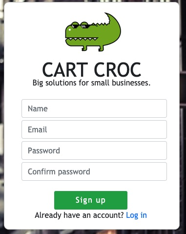
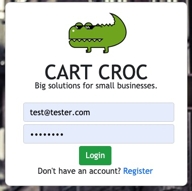
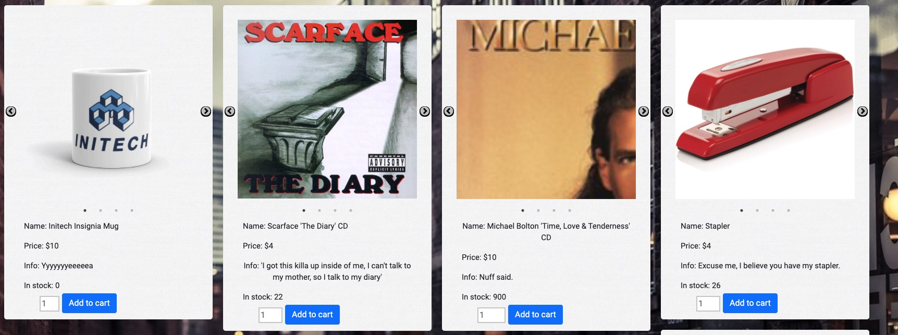
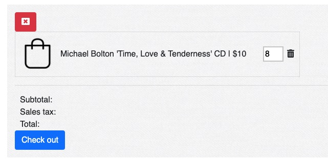
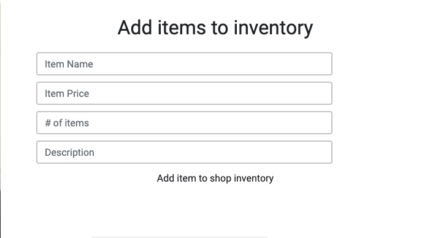

# Cart Croc
### Big Solutions for Small Businesses. 
Cart Croc is a point of sale (POS) application optimized for: Tracking consumers, managing inventory, and logging sales. This application was created using the MERN stack.

# Creators:
- [Cory Quirk](https://github.com/coryjquirk "Cory")
- [Josh Thorngren](https://github.com/josh8903 "Josh")
- [Eric Osowski](https://github.com/EricJamesOsowski "Eric")
- [Ryan Freese](https://github.com/KeepTheLidOnTight "Ryan")

# Links:
* Deployed Application: https://cart-croc.herokuapp.com

* Github Repository: https://github.com/coryjquirk/cart-croc

# Demo:

# User Overview:
- New users can register themselves with credentials of their choosing.

- Existing users can login to the application.

- Usercan can view products that are for sale.

- Users can add items from inventory into their cart.

# Business Owner Overview:
- Owners can update their inventory with products. Cart Croc automatically updates items in the inventory when they are purchased.

# Technologies: 
- Back-End:
    - Database: MongoDB
        - deployment: MongoDB Atlas
    - Server: Node.js
    - Server Framework: Express.js
    - Validation: Passport.js
        - [mern-auth](https://github.com/rishipr/mern-auth)

* Front-End:
    * Design framework: 
        * [React.js](https://reactjs.org/)
        * [Bootstrap](https://getbootstrap.com/)
    * Images:
        * [react-modal-image](https://github.com/aautio/react-modal-image)
        * [react-image-magnify](https://github.com/ethanselzer/react-image-magnify)
        * [react-slick](https://github.com/akiran/react-slick) (image carousel)
    * [Fontawesome icons](https://fontawesome.com/icons?d=gallery)
    * [Transparent Textures](https://www.transparenttextures.com/)

- Deployment:
    - [Heroku](https://dashboard.heroku.com/apps)
    
## Future development:
    * iOS/Android app
    * Secure credit card payments
    * Expanded shop admin controls
    * Email/text receipts
# License Information
* The Unlicense
